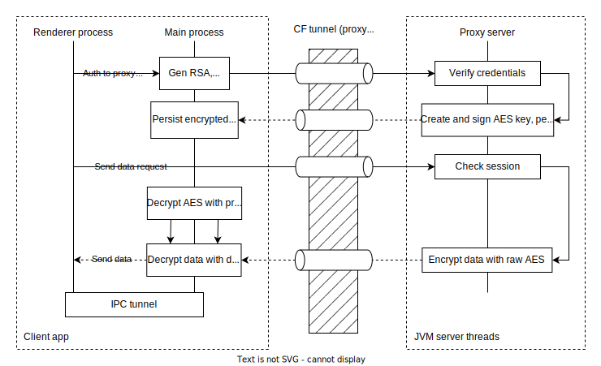

# Event Proxy System

[[Docker image](https://hub.docker.com/r/milosz08/event-proxy-server)] |
[[About project](https://miloszgilga.pl/project/event-proxy-system)]

Event proxy system receiving events from a fake SMTP server (on the local network), parsing them and
sending them via real-time communication channels (SSE). It also includes a simple REST client with
CRUD operations and desktop application receiving these events from multiple proxy servers.

Build with Lightweight embed Jetty servlet container, Java raw TCP sockets and Electron with React
(client app).

## Table of content

* [Basic concept](#basic-concept)
* [Clone, and run server](#clone-and-run-server)
* [Run client in development environment](#run-client-in-development-environment)
* [Package client (create executables)](#package-client-create-executables)
* [Disclaimer](#disclaimer)
* [Tech stack](#tech-stack)
* [Author](#author)
* [License](#license)

## Basic concept

The core concept involves a fully isolated local network (e.g., 192.168.X.X) containing a mock SMTP
proxy server that receives events from internal devices, such as a DVR. Data from this server is
stored in a database and delivered to clients via a secure Cloudflare tunnel, which removes the need
for risky port forwarding. Furthermore, messages are End-to-End encrypted, ensuring that no one, not
even Cloudflare's edge servers, can decrypt the content.

Server does not contain complex and heavyweight frameworks (like Spring, Spring Boot) and is
built on a pure Jetty server to achieve the smallest possible memory footprint.


## In-transit envelope encryption

The key principle of this architecture is strict isolation: the Renderer (UI) process is completely
separate from the Main process, which solely manages cryptography. It implements envelope
encryption, which is a strategy of encrypting data with a symmetric key (AES) that is then
encrypted with an asymmetric key (RSA).

1. The Main process sends an RSA public key to the proxy server during authentication.
2. The trusted server verifies the credentials, creates an AES session key, persists it, and sends
   it back encrypted with the client's public key.
3. When data is requested, the server uses the persisted AES key in AES-GCM mode. This mode, in
   addition to the ciphertext, generates a unique nonce and an Authentication Tag (tag), which
   mitigates the risk of data tampering (like bit-flipping attacks) by intermediaries, ensuring
   payload integrity.
4. The client's Main process receives the packet (ciphertext, nonce, tag), decrypts the AES key, and
   then uses it to decrypt the data while simultaneously verifying its authenticity using the tag.
5. Finally, the plaintext (decrypted) data is sent to the Renderer via the IPC tunnel.



## Clone, and run server

1. Clone repository on your local machine via:

```bash
$ git clone https://github.com/milosz08/event-proxy-system
```

2. Build server:

```bash
$ ./mvnw clean package -pl event-proxy-server
```

3. Run server in your local network area (on Raspberry Pi or other device with JVM 17):

```bash
$ java -Xms=128m -Xmx=128m -jar event-proxy-server.jar
```

4. Alternatively, get server from DockerHub repository and run it using `docker-compose.yml` file
   (check [docker README](/event-proxy-server/docker/README.md)) or build and run with docker
   locally:

```bash
$ docker compose up -d
```

## Run client in development environment

1. Make sure you have the latest LTS Node and yarn (if you do not have yarn, you can install it via
   `npm i -g yarn`).
2. Go to `event-desktop-client` and install dependencies via:

```bash
$ cd event-desktop-client
$ yarn install --frozen-lockfile
```

3. To run client in development mode (with hot-reload), type:

```bash
$ yarn run dev:watch
```

Alternatively you can use prepared Intellij run configuration (in `.run` directory).

## Package client (create executables)

> [!NOTE]
> To build an executable package for a specific operating system, you must run the build process on
> that exact system:
> - building `.dmg` (macOS): You must run `yarn run build:mac` on a computer running macOS,
> - building `.msi` (Windows): You must run `yarn run build:win` on a computer running Windows,
> - building `.AppImage` (Linux): You must run `yarn run build:linux` on a Linux distribution.

Run platform dependent build via:

```bash
$ ./mvnw clean package -pl event-desktop-client
```

output binary files you will find in `event-desktop-client/dist`

## Disclaimer

This software is provided "as is", without any warranty. You use it at your own risk, and the author
is not responsible for any damages resulting from its use.

## Tech stack

* Java 17, Jakarta EE (servlets),
* JCA, JCE (crypto),
* Eclipse Jetty embeddable server,
* JDBC, SQLite JDBC, SQLite database,
* Jakarta Mail,
* BCrypt,
* Electron with React.

## Author

Created by Miłosz Gilga. If you have any questions about this software, send
message: [miloszgilga@gmail.com](mailto:miloszgilga@gmail.com).

## License

This project is licensed under the Apache 2.0 License.
